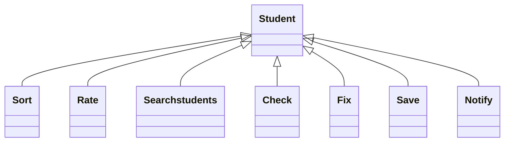

# Student Management System:

+ Add new students records and details.

+ View all students data.

+ Edit/Modify details.

+ Update the data if necessary

+ Delete data easily without any complexity

## I have some more objects information students

